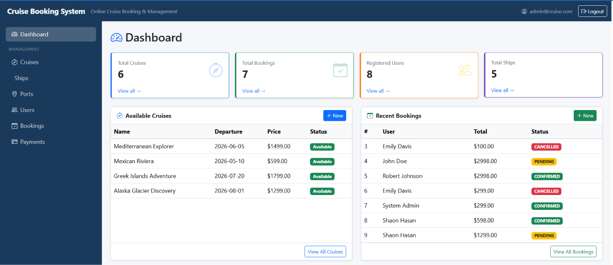
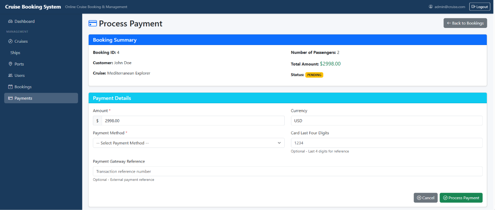

# Online Cruise Booking System

Online Cruise Booking System is a full-stack web application built with Spring Boot, Thymeleaf, and MySQL. It provides a complete cruise reservation management system with user authentication, booking workflow, payment processing, and administrative features for managing cruises, ships, ports, and cabins.

---

## Technology Stack

### Backend
| Technology | Version |
|------------|---------|
| Java | 21 |
| Spring Boot | 4.0.3 |
| Spring Security | 6.x (form-based authentication) |
| Spring Data JPA | 4.0.3 |
| Hibernate | 7.2.4.Final |
| MySQL | 8.0.44 |
| Maven | 3.9+ |
| BCrypt | Password encryption |
| iText 7 | PDF generation |

### Frontend
| Technology | Version |
|------------|---------|
| Thymeleaf | 3.1.x |
| Bootstrap | 5.x |
| Bootstrap Icons | Latest |
| HTML5/CSS3 | Standard |
| JavaScript | ES6+ |

---

## Features

- **User Authentication** — Secure login and registration with BCrypt password hashing
- **Role-Based Access Control** — Support for ROLE_USER and ROLE_ADMIN
- **Dashboard** — Live summary of cruises, bookings, users, and ships
- **Cruise Management** — Create, edit, and delete cruise schedules with ship and port assignments
- **Booking Management** — Complete booking workflow (PENDING → CONFIRMED → CANCELLED)
- **Passenger Management** — Add and manage passenger details for each booking
- **Payment Processing** — Support for Credit Card, Debit Card, PayPal, Apple Pay, and Google Pay
- **PDF Receipt Generation** — Downloadable payment receipts with booking details
- **Cabin Type Management** — Interior, Ocean View, Balcony, Suite, and Family Suite options
- **Ship Management** — Manage cruise ship fleet with capacity and operator details
- **Port Management** — Manage departure and arrival port information
- **User Profile Management** — Update personal information and view booking history
- **Cancellation Policy** — 10-day cancellation rule enforcement with date validation

---

---

## Screenshots

### Dashboard
<!-- Screenshot: Main dashboard with statistics -->


---

### Login Page
<!-- Screenshot: User login page -->


---


### Cruise List
<!-- Screenshot: Available cruises page -->


---

### Cruise Details
<!-- Screenshot: Detailed cruise information -->


---


### Booking List
<!-- Screenshot: All bookings with status -->


---


### Payment Form
<!-- Screenshot: Payment processing page -->


### Transaction Details
<!-- Screenshot: Transaction details page -->


---

### Payment Receipt (PDF)
<!-- Screenshot: Generated PDF receipt -->


---

### Ship Management
<!-- Screenshot: Ships list and management -->


---

### Port Management
<!-- Screenshot: Ports list and management -->


---

### User Profile
<!-- Screenshot: User profile page -->


---

## Project Structure

```
online-cruise-booking-system/
├── docs/
│   ├── Requirement.md              # Detailed functional requirements
│   ├── assignment02.md             # Assignment instructions
│   ├── class-diagram.md            # Entity class diagrams
│   ├── database-diagram.md         # Comprehensive database schema
│   └── simple-database-diagram.md  # Simplified ER diagram
└── src/
    └── Khaleda_COMP303_Assingment2/
        ├── src/main/
        │   ├── java/com/cruise/booking/
        │   │   ├── config/
        │   │   │   ├── DatabaseConfig.java
        │   │   │   ├── SecurityConfig.java
        │   │   │   ├── WebConfig.java
        │   │   │   └── DataLoader.java
        │   │   ├── controller/
        │   │   │   ├── AuthController.java
        │   │   │   ├── BookingController.java
        │   │   │   ├── CruiseController.java
        │   │   │   ├── HomeController.java
        │   │   │   ├── PassengerController.java
        │   │   │   ├── PaymentController.java
        │   │   │   ├── PortController.java
        │   │   │   ├── ShipController.java
        │   │   │   └── UserController.java
        │   │   ├── entity/
        │   │   │   ├── Booking.java
        │   │   │   ├── CabinType.java
        │   │   │   ├── Cruise.java
        │   │   │   ├── CruiseCabin.java
        │   │   │   ├── Passenger.java
        │   │   │   ├── PaymentTransaction.java
        │   │   │   ├── Port.java
        │   │   │   ├── Ship.java
        │   │   │   └── User.java
        │   │   ├── repository/
        │   │   │   ├── BookingRepository.java
        │   │   │   ├── CabinTypeRepository.java
        │   │   │   ├── CruiseCabinRepository.java
        │   │   │   ├── CruiseRepository.java
        │   │   │   ├── PassengerRepository.java
        │   │   │   ├── PaymentTransactionRepository.java
        │   │   │   ├── PortRepository.java
        │   │   │   ├── ShipRepository.java
        │   │   │   └── UserRepository.java
        │   │   └── service/
        │   │       ├── BookingService.java
        │   │       ├── CabinTypeService.java
        │   │       ├── CruiseCabinService.java
        │   │       ├── CruiseService.java
        │   │       ├── CustomUserDetailsService.java
        │   │       ├── FileStorageService.java
        │   │       ├── PassengerService.java
        │   │       ├── PaymentTransactionService.java
        │   │       ├── PortService.java
        │   │       ├── ShipService.java
        │   │       └── UserService.java
        │   └── resources/
        │       ├── application.properties
        │       └── templates/
        │           ├── auth/
        │           │   ├── login.html
        │           │   └── register.html
        │           ├── bookings/
        │           │   ├── form.html
        │           │   └── list.html
        │           ├── cruises/
        │           │   ├── detail.html
        │           │   ├── form.html
        │           │   └── list.html
        │           ├── fragments/
        │           │   └── layout.html
        │           ├── passengers/
        │           │   └── form.html
        │           ├── payments/
        │           │   ├── form.html
        │           │   └── list.html
        │           ├── ports/
        │           │   ├── form.html
        │           │   └── list.html
        │           ├── ships/
        │           │   ├── form.html
        │           │   └── list.html
        │           ├── users/
        │           │   ├── form.html
        │           │   └── list.html
        │           └── index.html
        ├── uploads/ships/              # Ship images storage
        └── pom.xml
```

---

## Prerequisites

- **Java** 21 or higher
- **Maven** 3.9 or higher
- **MySQL** 8.0 or higher
- **Git** (for cloning the repository)

---

## Setup and Running

### 1. Clone the Repository

```bash
git clone https://github.com/yourusername/online-cruise-booking-system.git
cd online-cruise-booking-system
```

### 2. Database Setup (MySQL)

Connect to MySQL and create the database:

```sql
CREATE DATABASE cruisereservation;
CREATE USER 'cruiseuser'@'localhost' IDENTIFIED BY 'yourpassword';
GRANT ALL PRIVILEGES ON cruisereservation.* TO 'cruiseuser'@'localhost';
FLUSH PRIVILEGES;
```

### 3. Configure Application

Edit `src/Khaleda_COMP303_Assingment2/src/main/resources/application.properties`:

```properties
spring.datasource.url=jdbc:mysql://localhost:3306/cruisereservation
spring.datasource.username=cruiseuser
spring.datasource.password=yourpassword
spring.datasource.driver-class-name=com.mysql.cj.jdbc.Driver

# Server configuration
server.port=8011

# JPA/Hibernate configuration
spring.jpa.hibernate.ddl-auto=update
spring.jpa.show-sql=true
```

### 4. Build and Run the Application

#### Using Maven Wrapper (Recommended):

```bash
cd src/Khaleda_COMP303_Assingment2
./mvnw.cmd spring-boot:run    # Windows
./mvnw spring-boot:run         # Linux/Mac
```

#### Or using Maven:

```bash
cd src/Khaleda_COMP303_Assingment2
mvn clean package
java -jar target/cruise-booking-system-0.0.1-SNAPSHOT.jar
```

Application runs at: **http://localhost:8011**

### 5. Access the Application

Open your browser and navigate to:
```
http://localhost:8011
```

---

## Default Login Credentials

### Admin Account
- **Email:** admin@cruise.com
- **Password:** Admin@123
- **Role:** ROLE_ADMIN

### Test User Accounts
- **Email:** john.doe@email.com
- **Password:** password123
- **Role:** ROLE_USER

Additional test accounts: jane.smith@email.com, robert.johnson@email.com, emily.davis@email.com, michael.wilson@email.com (all with password: password123)

---

## Database Schema

The application uses 9 main tables:

| Table | Description |
|-------|-------------|
| **users** | User account information and authentication |
| **ships** | Cruise ships in the fleet |
| **ports** | Departure and arrival port locations |
| **cruises** | Scheduled cruise voyages |
| **cabin_types** | Interior, Ocean View, Balcony, Suite, Family Suite |
| **cruise_cabins** | Available cabins for each cruise with pricing |
| **bookings** | Customer reservations |
| **passengers** | Traveler details for each booking |
| **payment_transactions** | Payment records and receipts |

### Key Relationships:
- User → Bookings (One-to-Many)
- Ship → Cruises (One-to-Many)
- Cruise → Cruise_Cabins (One-to-Many)
- Booking → Passengers (One-to-Many)
- Booking → Payment_Transactions (One-to-Many)

---

## Application Workflow

### User Registration and Login
1. Navigate to the login page
2. Click "Create Account" for new users
3. Fill in registration form (first name, last name, email, password)
4. Login with registered credentials

### Making a Booking
1. Browse available cruises from the dashboard
2. View cruise details (ship, ports, dates, pricing)
3. Create a new booking
4. Add passenger information
5. Process payment
6. Download PDF receipt

### Managing Bookings
1. View all bookings from the bookings page
2. Edit booking details (cabin type, passenger count)
3. Cancel booking (if more than 10 days before departure)

### Admin Functions
1. Manage cruises, ships, and ports
2. View all user bookings
3. Manage cabin types and pricing
4. View payment transactions

---

## API-Like Endpoints

Base URL: `http://localhost:8011`

| Endpoint | Method | Description |
|----------|--------|-------------|
| `/login` | GET/POST | User authentication |
| `/register` | GET/POST | User registration |
| `/` | GET | Dashboard (authenticated users) |
| `/cruises` | GET | List all cruises |
| `/cruises/new` | GET | Create cruise form |
| `/cruises/save` | POST | Save cruise |
| `/bookings` | GET | List all bookings |
| `/bookings/new` | GET | Create booking form |
| `/bookings/save` | POST | Save booking |
| `/bookings/{id}/cancel` | GET | Cancel booking |
| `/passengers/booking/{bookingId}/new` | GET | Add passenger form |
| `/passengers/save` | POST | Save passenger |
| `/payments/new/{bookingId}` | GET | Payment form |
| `/payments/save` | POST | Process payment |
| `/payments/receipt/{transactionId}` | GET | Download PDF receipt |
| `/ships` | GET | List all ships |
| `/ports` | GET | List all ports |
| `/users` | GET | List all users (admin) |


## Business Rules

### Booking Cancellation Policy
- Customers can cancel bookings **up to 10 days before departure**
- Cancellations within 10 days are **rejected**
- Cancelled bookings restore cabin availability
- Payment status is updated to REFUNDED

### Price Calculation
```
Total Price = Base Price × Number of Passengers × Cabin Price Multiplier
```

Example:
- Base Price: $899.00
- Passengers: 2
- Cabin Multiplier: 1.5 (Balcony)
- **Total: $2,697.50**

### Booking Status Lifecycle
```
PENDING → CONFIRMED → CANCELLED
```

---

## Seed Data

The application comes pre-loaded with sample data:

- **10 Ports:** Miami, Nassau, Cozumel, Rome, Barcelona, Venice, Santorini, Seattle, Juneau
- **5 Ships:** Oasis of the Seas, Harmony of the Seas, Carnival Vista, Allure of the Seas, Norwegian Epic
- **5 Cabin Types:** Interior, Ocean View, Balcony, Suite, Family Suite
- **5 Cruises:** Caribbean Paradise, Mediterranean Explorer, Mexican Riviera, Greek Islands Adventure, Alaska Glacier Discovery
- **5 Test Users:** john.doe@email.com, jane.smith@email.com, robert.johnson@email.com, emily.davis@email.com, michael.wilson@email.com

---

## Security Features

- **Password Encryption:** BCrypt hashing with Spring Security
- **Role-Based Access Control:** ROLE_USER, ROLE_ADMIN
- **Session Management:** Spring Security session handling
- **CSRF Protection:** Enabled by default
- **Form-Based Authentication:** Custom login page with error handling
- **Secure Password Storage:** No plain text passwords in database

---

## Development Notes

### Project Information
- **Student Name:** Khaleda Islam
- **Student ID:** 301504989
- **Course:** COMP303 - Java Enterprise Edition
- **Assignment:** Assignment 2
- **Submission Date:** March 10, 2026
- **Institution:** Centennial College

### Assessment Rubric
- Functionalities (Requirements 1-7): 30 points
- MySQL database design and JPA/CRUD: 12 points
- UI friendliness and navigation: 6 points
- Input validations and code standards: 6 points
- Lab Demo: 6 points
- **Total:** 60 points (15% of overall grade)

---

## Troubleshooting

### Database Connection Issues
- Ensure MySQL service is running
- Verify database credentials in `application.properties`
- Check if database `cruisereservation` exists

### Port Already in Use
- Change `server.port` in `application.properties`
- Or stop the process using port 8011

### Build Errors
```bash
mvn clean install -U
```

### Hibernate Schema Issues
- Set `spring.jpa.hibernate.ddl-auto=create` for fresh schema
- Set `spring.jpa.hibernate.ddl-auto=update` for existing database

---

## Future Enhancements

- [ ] Email notifications for booking confirmations
- [ ] Real payment gateway integration (Stripe, PayPal)
- [ ] Advanced search and filtering for cruises
- [ ] Multi-language support
- [ ] Mobile responsive improvements
- [ ] Booking modification audit trail
- [ ] Customer reviews and ratings
- [ ] Loyalty program and discounts
- [ ] Real-time cabin availability updates
- [ ] Integration with external cruise APIs

---

## License

This project is developed as an academic assignment for COMP303 - Java Enterprise Edition at Centennial College.

---

## Contact

**Khaleda Islam**  
Student ID: 301504989  
Centennial College

---

## Acknowledgments

- Spring Boot Documentation
- Thymeleaf Documentation
- Bootstrap Documentation
- iText PDF Library
- MySQL Documentation
- Centennial College COMP303 Course Materials

---

**Built with ❤️ using Spring Boot and Thymeleaf**
