# Class Diagram - Spring Boot Application

## Entity Class Diagram

```mermaid
classDiagram
    class User {
        -Long userId
        -String email
        -String passwordHash
        -String firstName
        -String lastName
        -String phone
        -String address
        -String city
        -String postalCode
        -LocalDateTime createdAt
        -LocalDateTime updatedAt
        -List~Booking~ bookings
        +getUserId() Long
        +setUserId(Long) void
        +getEmail() String
        +setEmail(String) void
        +getFirstName() String
        +setFirstName(String) void
        +getLastName() String
        +setLastName(String) void
        +getBookings() List~Booking~
        +setBookings(List~Booking~) void
    }

    class Ship {
        -Long shipId
        -String shipName
        -String shipType
        -Integer capacity
        -Integer yearBuilt
        -String operator
        -LocalDateTime createdAt
        -List~Cruise~ cruises
        +getShipId() Long
        +setShipId(Long) void
        +getShipName() String
        +setShipName(String) void
        +getCapacity() Integer
        +setCapacity(Integer) void
        +getCruises() List~Cruise~
        +setCruises(List~Cruise~) void
    }

    class Port {
        -Long portId
        -String portName
        -String city
        -String country
        -String portCode
        -List~Cruise~ departureCruises
        -List~Cruise~ arrivalCruises
        +getPortId() Long
        +setPortId(Long) void
        +getPortName() String
        +setPortName(String) void
        +getCity() String
        +setCity(String) void
        +getCountry() String
        +setCountry(String) void
        +getPortCode() String
        +setPortCode(String) void
    }

    class Cruise {
        -Long cruiseId
        -String cruiseName
        -LocalDate departureDate
        -LocalDate returnDate
        -Integer durationDays
        -BigDecimal basePrice
        -String status
        -LocalDateTime createdAt
        -Ship ship
        -Port departurePort
        -Port arrivalPort
        -List~CruiseCabin~ cruiseCabins
        -List~Booking~ bookings
        +getCruiseId() Long
        +setCruiseId(Long) void
        +getCruiseName() String
        +setCruiseName(String) void
        +getDepartureDate() LocalDate
        +setDepartureDate(LocalDate) void
        +getBasePrice() BigDecimal
        +setBasePrice(BigDecimal) void
        +getShip() Ship
        +setShip(Ship) void
        +getDeparturePort() Port
        +setDeparturePort(Port) void
        +getArrivalPort() Port
        +setArrivalPort(Port) void
    }

    class CabinType {
        -Long cabinTypeId
        -String typeName
        -String description
        -Integer maxOccupancy
        -BigDecimal sizeSqft
        -String amenities
        -String bedConfiguration
        -List~CruiseCabin~ cruiseCabins
        +getCabinTypeId() Long
        +setCabinTypeId(Long) void
        +getTypeName() String
        +setTypeName(String) void
        +getMaxOccupancy() Integer
        +setMaxOccupancy(Integer) void
        +getCruiseCabins() List~CruiseCabin~
        +setCruiseCabins(List~CruiseCabin~) void
    }

    class CruiseCabin {
        -Long cruiseCabinId
        -String cabinNumber
        -String deck
        -BigDecimal priceMultiplier
        -Integer availableQuantity
        -String viewType
        -Cruise cruise
        -CabinType cabinType
        -List~Booking~ bookings
        +getCruiseCabinId() Long
        +setCruiseCabinId(Long) void
        +getCabinNumber() String
        +setCabinNumber(String) void
        +getPriceMultiplier() BigDecimal
        +setPriceMultiplier(BigDecimal) void
        +getAvailableQuantity() Integer
        +setAvailableQuantity(Integer) void
        +getCruise() Cruise
        +setCruise(Cruise) void
        +getCabinType() CabinType
        +setCabinType(CabinType) void
    }

    class Booking {
        -Long bookingId
        -LocalDate bookingDate
        -Integer numberOfPassengers
        -BigDecimal totalPrice
        -String bookingStatus
        -String specialRequests
        -LocalDateTime createdAt
        -LocalDateTime updatedAt
        -User user
        -Cruise cruise
        -CruiseCabin cruiseCabin
        -List~Passenger~ passengers
        -List~PaymentTransaction~ paymentTransactions
        +getBookingId() Long
        +setBookingId(Long) void
        +getBookingDate() LocalDate
        +setBookingDate(LocalDate) void
        +getTotalPrice() BigDecimal
        +setTotalPrice(BigDecimal) void
        +getUser() User
        +setUser(User) void
        +getCruise() Cruise
        +setCruise(Cruise) void
        +getPassengers() List~Passenger~
        +setPassengers(List~Passenger~) void
    }

    class Passenger {
        -Long passengerId
        -String firstName
        -String lastName
        -LocalDate dateOfBirth
        -String gender
        -String nationality
        -String passportNumber
        -LocalDate passportExpiry
        -String dietaryRequirements
        -String medicalNotes
        -Booking booking
        +getPassengerId() Long
        +setPassengerId(Long) void
        +getFirstName() String
        +setFirstName(String) void
        +getLastName() String
        +setLastName(String) void
        +getDateOfBirth() LocalDate
        +setDateOfBirth(LocalDate) void
        +getBooking() Booking
        +setBooking(Booking) void
    }

    class PaymentTransaction {
        -Long transactionId
        -BigDecimal amount
        -String paymentMethod
        -String transactionStatus
        -LocalDateTime transactionDate
        -String paymentGatewayRef
        -String cardLastFour
        -String currency
        -Booking booking
        +getTransactionId() Long
        +setTransactionId(Long) void
        +getAmount() BigDecimal
        +setAmount(BigDecimal) void
        +getPaymentMethod() String
        +setPaymentMethod(String) void
        +getTransactionStatus() String
        +setTransactionStatus(String) void
        +getBooking() Booking
        +setBooking(Booking) void
    }

    %% Relationships
    User "1" --> "0..*" Booking : has
    Ship "1" --> "0..*" Cruise : operates
    Port "1" --> "0..*" Cruise : departurePort
    Port "1" --> "0..*" Cruise : arrivalPort
    Cruise "1" --> "0..*" CruiseCabin : contains
    CabinType "1" --> "0..*" CruiseCabin : defines
    Cruise "1" --> "0..*" Booking : receives
    Booking "1" --> "0..*" Passenger : includes
    Booking "1" --> "0..*" PaymentTransaction : paidBy
    User "1" --> "0..*" Booking : makes
    CruiseCabin "1" --> "0..*" Booking : assignedTo
```



---

## JPA Entity Annotations Guide

### User Entity
```java
@Entity
@Table(name = "users")
public class User {
    @Id
    @GeneratedValue(strategy = GenerationType.IDENTITY)
    @Column(name = "user_id")
    private Long userId;
    
    @Column(unique = true, nullable = false)
    private String email;
    
    @Column(name = "password_hash", nullable = false)
    private String passwordHash;
    
    @OneToMany(mappedBy = "user", cascade = CascadeType.ALL)
    private List<Booking> bookings;
    
    // Getters and setters...
}
```

### Ship Entity
```java
@Entity
@Table(name = "ships")
public class Ship {
    @Id
    @GeneratedValue(strategy = GenerationType.IDENTITY)
    @Column(name = "ship_id")
    private Long shipId;
    
    @Column(name = "ship_name", unique = true, nullable = false)
    private String shipName;
    
    @OneToMany(mappedBy = "ship", cascade = CascadeType.ALL)
    private List<Cruise> cruises;
    
    // Getters and setters...
}
```

### Port Entity
```java
@Entity
@Table(name = "ports")
public class Port {
    @Id
    @GeneratedValue(strategy = GenerationType.IDENTITY)
    @Column(name = "port_id")
    private Long portId;
    
    @Column(name = "port_name", unique = true, nullable = false)
    private String portName;
    
    @Column(name = "port_code", unique = true, nullable = false)
    private String portCode;
    
    @OneToMany(mappedBy = "departurePort")
    private List<Cruise> departureCruises;
    
    @OneToMany(mappedBy = "arrivalPort")
    private List<Cruise> arrivalCruises;
    
    // Getters and setters...
}
```

### Cruise Entity
```java
@Entity
@Table(name = "cruises")
public class Cruise {
    @Id
    @GeneratedValue(strategy = GenerationType.IDENTITY)
    @Column(name = "cruise_id")
    private Long cruiseId;
    
    @Column(name = "cruise_name", nullable = false)
    private String cruiseName;
    
    @Column(name = "base_price", nullable = false)
    private BigDecimal basePrice;
    
    @ManyToOne
    @JoinColumn(name = "ship_id", nullable = false)
    private Ship ship;
    
    @ManyToOne
    @JoinColumn(name = "departure_port_id", nullable = false)
    private Port departurePort;
    
    @ManyToOne
    @JoinColumn(name = "arrival_port_id", nullable = false)
    private Port arrivalPort;
    
    @OneToMany(mappedBy = "cruise", cascade = CascadeType.ALL)
    private List<CruiseCabin> cruiseCabins;
    
    @OneToMany(mappedBy = "cruise")
    private List<Booking> bookings;
    
    // Getters and setters...
}
```

### CabinType Entity
```java
@Entity
@Table(name = "cabin_types")
public class CabinType {
    @Id
    @GeneratedValue(strategy = GenerationType.IDENTITY)
    @Column(name = "cabin_type_id")
    private Long cabinTypeId;
    
    @Column(name = "type_name", unique = true, nullable = false)
    private String typeName;
    
    @Column(name = "max_occupancy", nullable = false)
    private Integer maxOccupancy;
    
    @OneToMany(mappedBy = "cabinType", cascade = CascadeType.ALL)
    private List<CruiseCabin> cruiseCabins;
    
    // Getters and setters...
}
```

### CruiseCabin Entity
```java
@Entity
@Table(name = "cruise_cabins")
public class CruiseCabin {
    @Id
    @GeneratedValue(strategy = GenerationType.IDENTITY)
    @Column(name = "cruise_cabin_id")
    private Long cruiseCabinId;
    
    @Column(name = "cabin_number", nullable = false)
    private String cabinNumber;
    
    @ManyToOne
    @JoinColumn(name = "cruise_id", nullable = false)
    private Cruise cruise;
    
    @ManyToOne
    @JoinColumn(name = "cabin_type_id", nullable = false)
    private CabinType cabinType;
    
    @OneToMany(mappedBy = "cruiseCabin")
    private List<Booking> bookings;
    
    // Getters and setters...
}
```

### Booking Entity
```java
@Entity
@Table(name = "booking")
public class Booking {
    @Id
    @GeneratedValue(strategy = GenerationType.IDENTITY)
    @Column(name = "booking_id")
    private Long bookingId;
    
    @Column(name = "total_price", nullable = false)
    private BigDecimal totalPrice;
    
    @Column(name = "booking_status")
    private String bookingStatus;
    
    @ManyToOne
    @JoinColumn(name = "user_id", nullable = false)
    private User user;
    
    @ManyToOne
    @JoinColumn(name = "cruise_id", nullable = false)
    private Cruise cruise;
    
    @ManyToOne
    @JoinColumn(name = "cruise_cabin_id", nullable = false)
    private CruiseCabin cruiseCabin;
    
    @OneToMany(mappedBy = "booking", cascade = CascadeType.ALL)
    private List<Passenger> passengers;
    
    @OneToMany(mappedBy = "booking", cascade = CascadeType.ALL)
    private List<PaymentTransaction> paymentTransactions;
    
    // Getters and setters...
}
```

### Passenger Entity
```java
@Entity
@Table(name = "passengers")
public class Passenger {
    @Id
    @GeneratedValue(strategy = GenerationType.IDENTITY)
    @Column(name = "passenger_id")
    private Long passengerId;
    
    @Column(name = "first_name", nullable = false)
    private String firstName;
    
    @Column(name = "last_name", nullable = false)
    private String lastName;
    
    @ManyToOne
    @JoinColumn(name = "booking_id", nullable = false)
    private Booking booking;
    
    // Getters and setters...
}
```

### PaymentTransaction Entity
```java
@Entity
@Table(name = "payment_transactions")
public class PaymentTransaction {
    @Id
    @GeneratedValue(strategy = GenerationType.IDENTITY)
    @Column(name = "transaction_id")
    private Long transactionId;
    
    @Column(nullable = false)
    private BigDecimal amount;
    
    @Column(name = "payment_method", nullable = false)
    private String paymentMethod;
    
    @Column(name = "transaction_status")
    private String transactionStatus;
    
    @ManyToOne
    @JoinColumn(name = "booking_id", nullable = false)
    private Booking booking;
    
    // Getters and setters...
}
```

---

## Data Type Mappings

| Database Type | Java Type      | Description                           |
|---------------|----------------|---------------------------------------|
| INT           | Long/Integer   | Use Long for IDs, Integer for counts  |
| VARCHAR       | String         | Text data                             |
| DATE          | LocalDate      | Date without time                     |
| TIMESTAMP     | LocalDateTime  | Date with time                        |
| DECIMAL       | BigDecimal     | Precise decimal numbers (prices)      |

---

## Relationship Patterns

### One-to-Many (e.g., User → Booking)
- **Parent (One side):** `@OneToMany(mappedBy = "user")`
- **Child (Many side):** `@ManyToOne` + `@JoinColumn(name = "user_id")`

### Many-to-One (e.g., Booking → User)
- **Many side:** `@ManyToOne` + `@JoinColumn(name = "user_id")`
- **One side:** `@OneToMany(mappedBy = "user")`

---

## Package Structure Suggestion

```
com.cruise.booking
├── entity
│   ├── User.java
│   ├── Ship.java
│   ├── Port.java
│   ├── Cruise.java
│   ├── CabinType.java
│   ├── CruiseCabin.java
│   ├── Booking.java
│   ├── Passenger.java
│   └── PaymentTransaction.java
├── repository
│   ├── UserRepository.java
│   ├── ShipRepository.java
│   ├── PortRepository.java
│   ├── CruiseRepository.java
│   ├── CabinTypeRepository.java
│   ├── CruiseCabinRepository.java
│   ├── BookingRepository.java
│   ├── PassengerRepository.java
│   └── PaymentTransactionRepository.java
├── service
│   ├── UserService.java
│   ├── CruiseService.java
│   ├── BookingService.java
│   └── PaymentService.java
├── controller
│   ├── UserController.java
│   ├── CruiseController.java
│   ├── BookingController.java
│   └── PaymentController.java
└── dto
    ├── UserDTO.java
    ├── CruiseDTO.java
    ├── BookingDTO.java
    └── PaymentDTO.java
```

---

## Key Notes for Spring Boot Implementation

1. **Use Lombok:** Add `@Data`, `@NoArgsConstructor`, `@AllArgsConstructor` to reduce boilerplate
2. **Lazy Loading:** Use `fetch = FetchType.LAZY` for collections to avoid N+1 queries
3. **Cascade Operations:** Be careful with `CascadeType.ALL` - use specific cascade types where needed
4. **Bidirectional Relationships:** Always manage both sides when adding/removing items
5. **DTOs:** Use Data Transfer Objects for API responses to avoid circular references and control data exposure
6. **Validation:** Add `@Valid` and constraint annotations (`@NotNull`, `@Email`, `@Size`, etc.)
