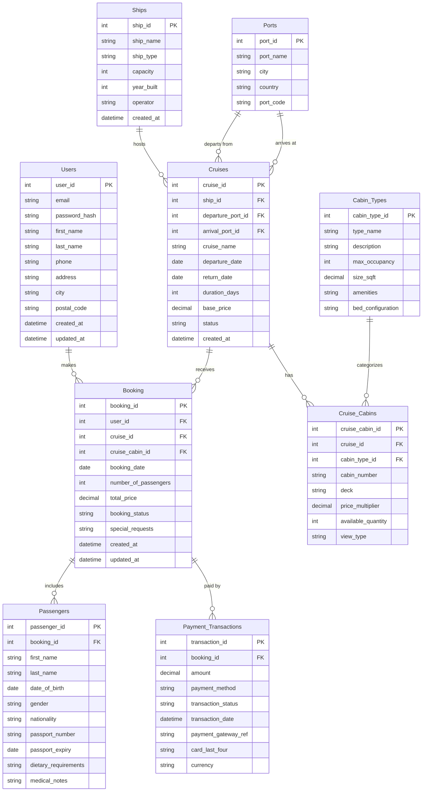

# Simple Cruise Booking Database Schema



## Table Descriptions

### Users
Stores customer account information for users who can make cruise bookings.

### Ships
Contains information about cruise ships in the fleet.

### Ports
Stores details about ports where ships dock. Each port can serve as both a departure point and an arrival destination for cruises.

### Cruises
Represents scheduled cruise voyages with specific ships, dates, and pricing.

### Cabin Types
Defines different categories of cabins (e.g., Interior, Oceanview, Balcony, Suite).

### Cruise Cabins
Links specific cabin types to cruises with pricing and availability information.

### Booking
Stores customer reservations for cruises (formerly "Reservations").

### Passengers
Contains information about individual passengers associated with each booking.

### Payment Transactions
Records all payment transactions related to bookings.

## Key Relationships

- A **User** can make multiple **Bookings**
- A **Ship** hosts multiple **Cruises**
- A **Cruise** has multiple **Cruise Cabins** of various **Cabin Types**
- A **Booking** is made by a **User** for a specific **Cruise** and **Cruise Cabin**
- A **Booking** includes multiple **Passengers**
- A **Booking** is associated with multiple **Payment Transactions**
---

## Table Definitions

### 1. Users Table
**Purpose:** Stores customer account information for cruise bookings

| Column Name    | Data Type      | Constraints                    | Description                          |
|----------------|----------------|--------------------------------|--------------------------------------|
| user_id        | INT            | PRIMARY KEY, AUTO_INCREMENT    | Unique user identifier               |
| email          | VARCHAR(255)   | UNIQUE, NOT NULL               | User's email address                 |
| password_hash  | VARCHAR(255)   | NOT NULL                       | Encrypted password                   |
| first_name     | VARCHAR(100)   | NOT NULL                       | User's first name                    |
| last_name      | VARCHAR(100)   | NOT NULL                       | User's last name                     |
| phone          | VARCHAR(20)    | NULL                           | Contact phone number                 |
| address        | VARCHAR(255)   | NULL                           | Street address                       |
| city           | VARCHAR(100)   | NULL                           | City                                 |
| postal_code    | VARCHAR(20)    | NULL                           | Postal/ZIP code                      |
| created_at     | TIMESTAMP      | DEFAULT CURRENT_TIMESTAMP      | Account creation timestamp           |
| updated_at     | TIMESTAMP      | ON UPDATE CURRENT_TIMESTAMP    | Last update timestamp                |

---

### 2. Ships Table
**Purpose:** Contains information about cruise ships in the fleet

| Column Name  | Data Type    | Constraints                 | Description                    |
|--------------|--------------|----------------------------|--------------------------------|
| ship_id      | INT          | PRIMARY KEY, AUTO_INCREMENT| Unique ship identifier         |
| ship_name    | VARCHAR(100) | UNIQUE, NOT NULL           | Name of the ship               |
| ship_type    | VARCHAR(50)  | NULL                       | Ship type/class                |
| capacity     | INT          | NOT NULL                   | Maximum passenger capacity     |
| year_built   | INT          | NULL                       | Year the ship was built        |
| operator     | VARCHAR(100) | NULL                       | Cruise line operator           |
| created_at   | TIMESTAMP    | DEFAULT CURRENT_TIMESTAMP  | Record creation timestamp      |

---

### 3. Ports Table
**Purpose:** Stores port information for departures and arrivals

| Column Name | Data Type    | Constraints                 | Description                    |
|-------------|--------------|----------------------------|--------------------------------|
| port_id     | INT          | PRIMARY KEY, AUTO_INCREMENT| Unique port identifier         |
| port_name   | VARCHAR(100) | UNIQUE, NOT NULL           | Port name                      |
| city        | VARCHAR(100) | NOT NULL                   | City name                      |
| country     | VARCHAR(100) | NOT NULL                   | Country name                   |
| port_code   | VARCHAR(10)  | UNIQUE, NOT NULL           | Port code (e.g., MIA, NYC)     |

---

### 4. Cruises Table
**Purpose:** Represents scheduled cruise voyages

| Column Name        | Data Type     | Constraints                       | Description                      |
|--------------------|---------------|-----------------------------------|----------------------------------|
| cruise_id          | INT           | PRIMARY KEY, AUTO_INCREMENT       | Unique cruise identifier         |
| ship_id            | INT           | FOREIGN KEY (Ships.ship_id)       | Ship operating this cruise       |
| departure_port_id  | INT           | FOREIGN KEY (Ports.port_id)       | Departure port                   |
| arrival_port_id    | INT           | FOREIGN KEY (Ports.port_id)       | Arrival/destination port         |
| cruise_name        | VARCHAR(100)  | NOT NULL                          | Name of the cruise               |
| departure_date     | DATE          | NOT NULL                          | Cruise departure date            |
| return_date        | DATE          | NOT NULL                          | Cruise return date               |
| duration_days      | INT           | NOT NULL                          | Cruise duration in days          |
| base_price         | DECIMAL(10,2) | NOT NULL                          | Base price per person            |
| status             | VARCHAR(20)   | DEFAULT 'SCHEDULED'               | Cruise status                    |
| created_at         | TIMESTAMP     | DEFAULT CURRENT_TIMESTAMP         | Record creation timestamp        |

---

### 5. Cabin_Types Table
**Purpose:** Defines different cabin categories

| Column Name        | Data Type     | Constraints                 | Description                    |
|--------------------|---------------|----------------------------|--------------------------------|
| cabin_type_id      | INT           | PRIMARY KEY, AUTO_INCREMENT| Unique cabin type identifier   |
| type_name          | VARCHAR(50)   | UNIQUE, NOT NULL           | Cabin type name                |
| description        | TEXT          | NULL                       | Cabin type description         |
| max_occupancy      | INT           | NOT NULL                   | Maximum number of guests       |
| size_sqft          | DECIMAL(8,2)  | NULL                       | Cabin size in square feet      |
| amenities          | TEXT          | NULL                       | Cabin amenities                |
| bed_configuration  | VARCHAR(100)  | NULL                       | Bed arrangement                |

---

### 6. Cruise_Cabins Table
**Purpose:** Links cabin types to specific cruises with pricing

| Column Name        | Data Type     | Constraints                         | Description                      |
|--------------------|---------------|-------------------------------------|----------------------------------|
| cruise_cabin_id    | INT           | PRIMARY KEY, AUTO_INCREMENT         | Unique cabin identifier          |
| cruise_id          | INT           | FOREIGN KEY (Cruises.cruise_id)     | Reference to cruise              |
| cabin_type_id      | INT           | FOREIGN KEY (Cabin_Types.c_type_id) | Cabin type                       |
| cabin_number       | VARCHAR(20)   | NOT NULL                            | Cabin number (e.g., A101)        |
| deck               | VARCHAR(20)   | NULL                                | Deck level                       |
| price_multiplier   | DECIMAL(5,2)  | DEFAULT 1.00                        | Price multiplier                 |
| available_quantity | INT           | NOT NULL                            | Number of available cabins       |
| view_type          | VARCHAR(50)   | NULL                                | View type (Ocean, Balcony, etc.) |

---

### 7. Booking Table
**Purpose:** Stores customer cruise reservations

| Column Name         | Data Type     | Constraints                         | Description                      |
|---------------------|---------------|-------------------------------------|----------------------------------|
| booking_id          | INT           | PRIMARY KEY, AUTO_INCREMENT         | Unique booking identifier        |
| user_id             | INT           | FOREIGN KEY (Users.user_id)         | Customer who made booking        |
| cruise_id           | INT           | FOREIGN KEY (Cruises.cruise_id)     | Booked cruise                    |
| cruise_cabin_id     | INT           | FOREIGN KEY (Cruise_Cabins.cc_id)   | Assigned cabin                   |
| booking_date        | DATE          | NOT NULL                            | Date of booking                  |
| number_of_passengers| INT           | NOT NULL                            | Total number of passengers       |
| total_price         | DECIMAL(10,2) | NOT NULL                            | Total booking price              |
| booking_status      | VARCHAR(20)   | DEFAULT 'PENDING'                   | Booking status                   |
| special_requests    | TEXT          | NULL                                | Special requests or notes        |
| created_at          | TIMESTAMP     | DEFAULT CURRENT_TIMESTAMP           | Record creation timestamp        |
| updated_at          | TIMESTAMP     | ON UPDATE CURRENT_TIMESTAMP         | Last update timestamp            |

---

### 8. Passengers Table
**Purpose:** Stores individual passenger information for each booking

| Column Name          | Data Type    | Constraints                       | Description                      |
|----------------------|--------------|-----------------------------------|----------------------------------|
| passenger_id         | INT          | PRIMARY KEY, AUTO_INCREMENT       | Unique passenger identifier      |
| booking_id           | INT          | FOREIGN KEY (Booking.booking_id)  | Reference to booking             |
| first_name           | VARCHAR(100) | NOT NULL                          | Passenger first name             |
| last_name            | VARCHAR(100) | NOT NULL                          | Passenger last name              |
| date_of_birth        | DATE         | NOT NULL                          | Passenger date of birth          |
| gender               | VARCHAR(10)  | NULL                              | Gender                           |
| nationality          | VARCHAR(100) | NULL                              | Passenger nationality            |
| passport_number      | VARCHAR(50)  | NULL                              | Passport number                  |
| passport_expiry      | DATE         | NULL                              | Passport expiry date             |
| dietary_requirements | TEXT         | NULL                              | Dietary needs                    |
| medical_notes        | TEXT         | NULL                              | Medical information              |

---

### 9. Payment_Transactions Table
**Purpose:** Records all payment transactions for bookings

| Column Name          | Data Type     | Constraints                       | Description                      |
|----------------------|---------------|-----------------------------------|----------------------------------|
| transaction_id       | INT           | PRIMARY KEY, AUTO_INCREMENT       | Unique transaction identifier    |
| booking_id           | INT           | FOREIGN KEY (Booking.booking_id)  | Reference to booking             |
| amount               | DECIMAL(10,2) | NOT NULL                          | Payment amount                   |
| payment_method       | VARCHAR(50)   | NOT NULL                          | Payment method used              |
| transaction_status   | VARCHAR(20)   | DEFAULT 'PENDING'                 | Transaction status               |
| transaction_date     | TIMESTAMP     | DEFAULT CURRENT_TIMESTAMP         | Transaction timestamp            |
| payment_gateway_ref  | VARCHAR(100)  | NULL                              | Payment gateway reference        |
| card_last_four       | VARCHAR(4)    | NULL                              | Last 4 digits of card            |
| currency             | VARCHAR(3)    | DEFAULT 'USD'                     | Currency code                    |

---

## SQL Schema Creation Scripts

### Create Users Table
```sql
CREATE TABLE users (
    user_id INT AUTO_INCREMENT PRIMARY KEY,
    email VARCHAR(255) NOT NULL UNIQUE,
    password_hash VARCHAR(255) NOT NULL,
    first_name VARCHAR(100) NOT NULL,
    last_name VARCHAR(100) NOT NULL,
    phone VARCHAR(20),
    address VARCHAR(255),
    city VARCHAR(100),
    postal_code VARCHAR(20),
    created_at TIMESTAMP DEFAULT CURRENT_TIMESTAMP,
    updated_at TIMESTAMP DEFAULT CURRENT_TIMESTAMP ON UPDATE CURRENT_TIMESTAMP,
    INDEX idx_email (email)
);
```

### Create Ships Table
```sql
CREATE TABLE ships (
    ship_id INT AUTO_INCREMENT PRIMARY KEY,
    ship_name VARCHAR(100) NOT NULL UNIQUE,
    ship_type VARCHAR(50),
    capacity INT NOT NULL,
    year_built INT,
    operator VARCHAR(100),
    created_at TIMESTAMP DEFAULT CURRENT_TIMESTAMP,
    INDEX idx_ship_name (ship_name)
);
```

### Create Ports Table
```sql
CREATE TABLE ports (
    port_id INT AUTO_INCREMENT PRIMARY KEY,
    port_name VARCHAR(100) NOT NULL UNIQUE,
    city VARCHAR(100) NOT NULL,
    country VARCHAR(100) NOT NULL,
    port_code VARCHAR(10) NOT NULL UNIQUE,
    INDEX idx_port_code (port_code)
);
```

### Create Cruises Table
```sql
CREATE TABLE cruises (
    cruise_id INT AUTO_INCREMENT PRIMARY KEY,
    ship_id INT NOT NULL,
    departure_port_id INT NOT NULL,
    arrival_port_id INT NOT NULL,
    cruise_name VARCHAR(100) NOT NULL,
    departure_date DATE NOT NULL,
    return_date DATE NOT NULL,
    duration_days INT NOT NULL,
    base_price DECIMAL(10,2) NOT NULL,
    status VARCHAR(20) DEFAULT 'SCHEDULED',
    created_at TIMESTAMP DEFAULT CURRENT_TIMESTAMP,
    FOREIGN KEY (ship_id) REFERENCES ships(ship_id) ON DELETE CASCADE,
    FOREIGN KEY (departure_port_id) REFERENCES ports(port_id),
    FOREIGN KEY (arrival_port_id) REFERENCES ports(port_id),
    INDEX idx_departure_date (departure_date),
    INDEX idx_status (status)
);
```

### Create Cabin_Types Table
```sql
CREATE TABLE cabin_types (
    cabin_type_id INT AUTO_INCREMENT PRIMARY KEY,
    type_name VARCHAR(50) NOT NULL UNIQUE,
    description TEXT,
    max_occupancy INT NOT NULL,
    size_sqft DECIMAL(8,2),
    amenities TEXT,
    bed_configuration VARCHAR(100),
    INDEX idx_type_name (type_name)
);
```

### Create Cruise_Cabins Table
```sql
CREATE TABLE cruise_cabins (
    cruise_cabin_id INT AUTO_INCREMENT PRIMARY KEY,
    cruise_id INT NOT NULL,
    cabin_type_id INT NOT NULL,
    cabin_number VARCHAR(20) NOT NULL,
    deck VARCHAR(20),
    price_multiplier DECIMAL(5,2) DEFAULT 1.00,
    available_quantity INT NOT NULL,
    view_type VARCHAR(50),
    FOREIGN KEY (cruise_id) REFERENCES cruises(cruise_id) ON DELETE CASCADE,
    FOREIGN KEY (cabin_type_id) REFERENCES cabin_types(cabin_type_id),
    INDEX idx_cruise_cabin (cruise_id, cabin_type_id)
);
```

### Create Booking Table
```sql
CREATE TABLE booking (
    booking_id INT AUTO_INCREMENT PRIMARY KEY,
    user_id INT NOT NULL,
    cruise_id INT NOT NULL,
    cruise_cabin_id INT NOT NULL,
    booking_date DATE NOT NULL,
    number_of_passengers INT NOT NULL,
    total_price DECIMAL(10,2) NOT NULL,
    booking_status VARCHAR(20) DEFAULT 'PENDING',
    special_requests TEXT,
    created_at TIMESTAMP DEFAULT CURRENT_TIMESTAMP,
    updated_at TIMESTAMP DEFAULT CURRENT_TIMESTAMP ON UPDATE CURRENT_TIMESTAMP,
    FOREIGN KEY (user_id) REFERENCES users(user_id) ON DELETE CASCADE,
    FOREIGN KEY (cruise_id) REFERENCES cruises(cruise_id),
    FOREIGN KEY (cruise_cabin_id) REFERENCES cruise_cabins(cruise_cabin_id),
    INDEX idx_user_id (user_id),
    INDEX idx_booking_status (booking_status)
);
```

### Create Passengers Table
```sql
CREATE TABLE passengers (
    passenger_id INT AUTO_INCREMENT PRIMARY KEY,
    booking_id INT NOT NULL,
    first_name VARCHAR(100) NOT NULL,
    last_name VARCHAR(100) NOT NULL,
    date_of_birth DATE NOT NULL,
    gender VARCHAR(10),
    nationality VARCHAR(100),
    passport_number VARCHAR(50),
    passport_expiry DATE,
    dietary_requirements TEXT,
    medical_notes TEXT,
    FOREIGN KEY (booking_id) REFERENCES booking(booking_id) ON DELETE CASCADE,
    INDEX idx_booking_id (booking_id)
);
```

### Create Payment_Transactions Table
```sql
CREATE TABLE payment_transactions (
    transaction_id INT AUTO_INCREMENT PRIMARY KEY,
    booking_id INT NOT NULL,
    amount DECIMAL(10,2) NOT NULL,
    payment_method VARCHAR(50) NOT NULL,
    transaction_status VARCHAR(20) DEFAULT 'PENDING',
    transaction_date TIMESTAMP DEFAULT CURRENT_TIMESTAMP,
    payment_gateway_ref VARCHAR(100),
    card_last_four VARCHAR(4),
    currency VARCHAR(3) DEFAULT 'USD',
    FOREIGN KEY (booking_id) REFERENCES booking(booking_id) ON DELETE CASCADE,
    INDEX idx_booking_id (booking_id),
    INDEX idx_transaction_status (transaction_status)
);
```

---

## Sample Data Insert Statements

### Insert Sample Users
```sql
INSERT INTO users (email, password_hash, first_name, last_name, phone, address, city, postal_code) VALUES
('john.doe@email.com', '$2a$10$hashed_password_1', 'John', 'Doe', '555-0101', '123 Main St', 'Miami', '33101'),
('jane.smith@email.com', '$2a$10$hashed_password_2', 'Jane', 'Smith', '555-0102', '456 Ocean Ave', 'Fort Lauderdale', '33301'),
('bob.wilson@email.com', '$2a$10$hashed_password_3', 'Bob', 'Wilson', '555-0103', '789 Beach Blvd', 'Tampa', '33602');
```

### Insert Sample Ships
```sql
INSERT INTO ships (ship_name, ship_type, capacity, year_built, operator) VALUES
('Ocean Explorer', 'Mega Ship', 3500, 2020, 'Caribbean Cruises Inc'),
('Sea Adventure', 'Large Ship', 2800, 2018, 'Caribbean Cruises Inc'),
('Tropical Paradise', 'Mid-Size Ship', 2000, 2019, 'Ocean Voyages Ltd'),
('Island Breeze', 'Large Ship', 3200, 2021, 'Caribbean Cruises Inc');
```

### Insert Sample Ports
```sql
INSERT INTO ports (port_name, city, country, port_code) VALUES
('Port of Miami', 'Miami', 'USA', 'MIA'),
('Port Canaveral', 'Cape Canaveral', 'USA', 'PCV'),
('Nassau Port', 'Nassau', 'Bahamas', 'NAS'),
('Cozumel Port', 'Cozumel', 'Mexico', 'CZM'),
('Grand Cayman Port', 'George Town', 'Cayman Islands', 'GCM'),
('Montego Bay Port', 'Montego Bay', 'Jamaica', 'MBJ');
```

### Insert Sample Cabin Types
```sql
INSERT INTO cabin_types (type_name, description, max_occupancy, size_sqft, amenities, bed_configuration) VALUES
('Interior', 'Cozy inside cabin, budget-friendly', 4, 150.00, 'TV, Mini-fridge, Safe', '2 Twin Beds'),
('Ocean View', 'Cabin with window or porthole', 4, 180.00, 'TV, Mini-fridge, Safe, Window', '1 Queen Bed'),
('Balcony', 'Private balcony with ocean views', 4, 220.00, 'TV, Mini-fridge, Safe, Private Balcony', '1 King Bed'),
('Suite', 'Spacious luxury suite', 6, 350.00, 'TV, Mini-fridge, Safe, Living Area, Premium Amenities', '1 King + Sofa Bed');
```

### Insert Sample Cruises
```sql
INSERT INTO cruises (ship_id, departure_port_id, arrival_port_id, cruise_name, departure_date, return_date, duration_days, base_price, status) VALUES
(1, 1, 3, 'Caribbean Paradise 7-Day', '2026-06-15', '2026-06-22', 7, 899.00, 'SCHEDULED'),
(2, 1, 4, 'Mexican Riviera Escape', '2026-07-01', '2026-07-08', 7, 799.00, 'SCHEDULED'),
(3, 2, 5, 'Tropical Island Getaway', '2026-08-10', '2026-08-15', 5, 649.00, 'SCHEDULED'),
(4, 1, 6, 'Jamaica Adventure', '2026-09-05', '2026-09-12', 7, 849.00, 'SCHEDULED');
```

### Insert Sample Cruise Cabins
```sql
INSERT INTO cruise_cabins (cruise_id, cabin_type_id, cabin_number, deck, price_multiplier, available_quantity, view_type) VALUES
-- Cruise 1 cabins
(1, 1, 'A101', 'Deck 3', 1.00, 50, 'Interior'),
(1, 2, 'B201', 'Deck 5', 1.30, 40, 'Ocean View'),
(1, 3, 'C301', 'Deck 7', 1.80, 30, 'Balcony'),
(1, 4, 'S401', 'Deck 9', 2.50, 10, 'Suite'),
-- Cruise 2 cabins
(2, 1, 'A102', 'Deck 3', 1.00, 45, 'Interior'),
(2, 2, 'B202', 'Deck 5', 1.30, 35, 'Ocean View'),
(2, 3, 'C302', 'Deck 7', 1.80, 25, 'Balcony');
```

### Insert Sample Bookings
```sql
INSERT INTO booking (user_id, cruise_id, cruise_cabin_id, booking_date, number_of_passengers, total_price, booking_status, special_requests) VALUES
(1, 1, 3, '2026-03-15', 2, 3236.00, 'CONFIRMED', 'Anniversary celebration - would appreciate champagne'),
(2, 2, 5, '2026-03-20', 3, 3117.00, 'CONFIRMED', 'Vegetarian meals required'),
(3, 3, 1, '2026-04-01', 4, 2596.00, 'PENDING', 'First time cruisers');
```

### Insert Sample Passengers
```sql
INSERT INTO passengers (booking_id, first_name, last_name, date_of_birth, gender, nationality, passport_number, passport_expiry, dietary_requirements) VALUES
-- Booking 1 passengers
(1, 'John', 'Doe', '1985-05-15', 'Male', 'USA', 'P12345678', '2030-05-15', NULL),
(1, 'Jane', 'Doe', '1987-08-22', 'Female', 'USA', 'P87654321', '2029-08-22', NULL),
-- Booking 2 passengers
(2, 'Jane', 'Smith', '1990-03-10', 'Female', 'USA', 'P11223344', '2031-03-10', 'Vegetarian'),
(2, 'Emily', 'Smith', '2015-07-12', 'Female', 'USA', 'P44332211', '2028-07-12', 'Vegetarian'),
(2, 'Tom', 'Smith', '2018-11-05', 'Male', 'USA', 'P55667788', '2028-11-05', 'Vegetarian');
```

### Insert Sample Payment Transactions
```sql
INSERT INTO payment_transactions (booking_id, amount, payment_method, transaction_status, payment_gateway_ref, card_last_four, currency) VALUES
(1, 3236.00, 'Credit Card', 'COMPLETED', 'TXN-2026-001234', '4532', 'USD'),
(2, 3117.00, 'Credit Card', 'COMPLETED', 'TXN-2026-001235', '5678', 'USD'),
(3, 1298.00, 'PayPal', 'PENDING', 'TXN-2026-001236', NULL, 'USD');
```